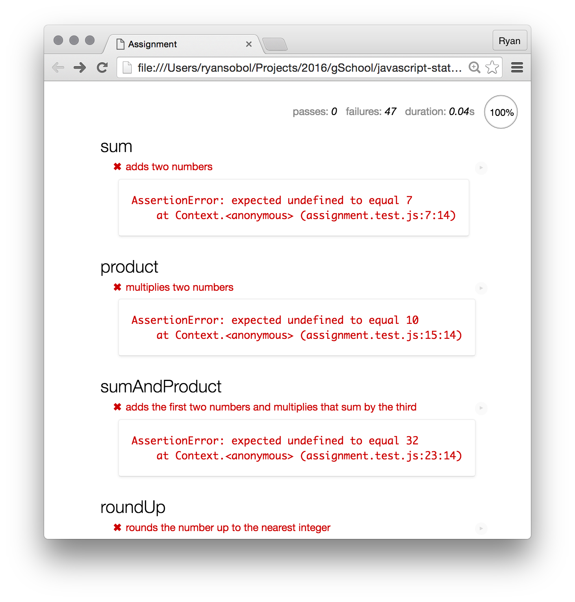
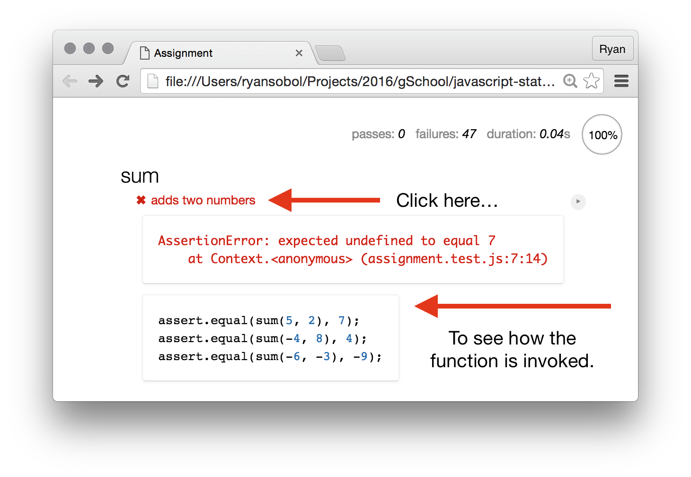
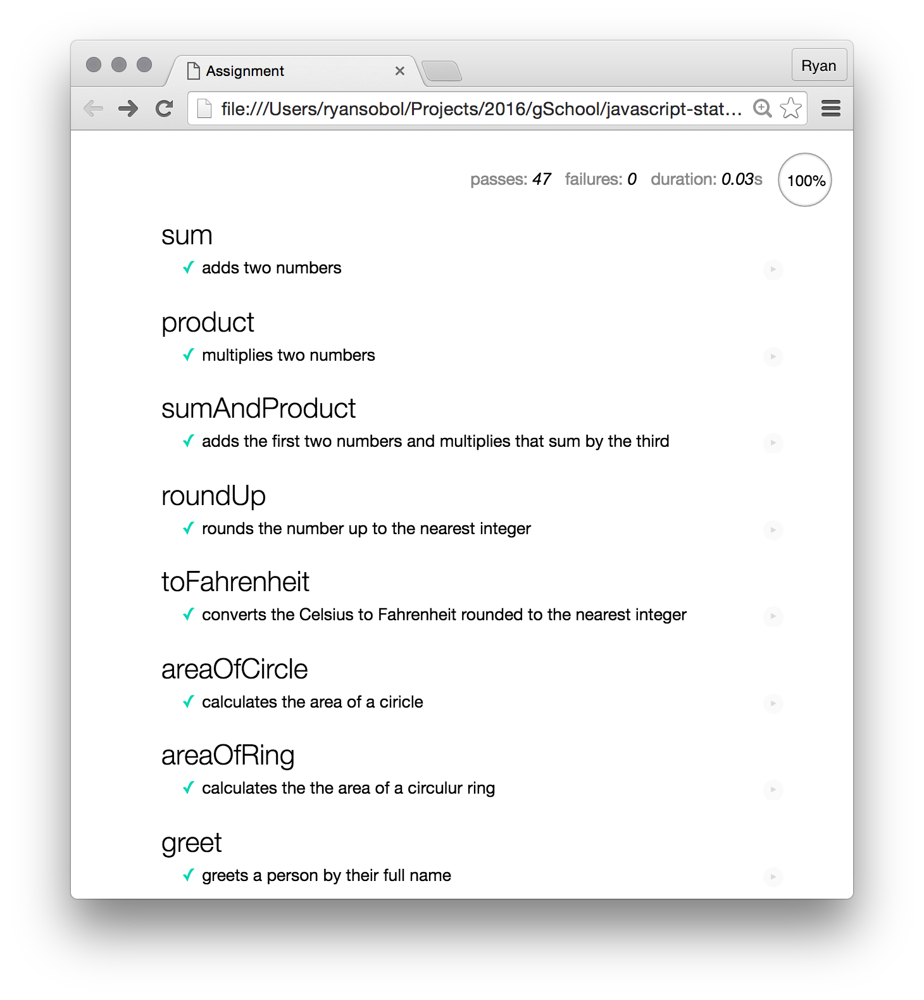

# Accumulator Problems

These are exercises to help you learn how to write basic algorithms 
and test your understanding on programming logic.

### Setup

To get started, download this project onto your machine.

In your web browser, looking at index.html page that is within the assignment folder, you'll see a page that shows a bunch of failing JavaScript tests. 

### How to proceed

Your job is to make all these JavaScript tests pass by completing their respective puzzle.

1. Open the `assignment/assignment.js` file in your text editor.
1. Read the instructions for each problem.
1. Solve the problem by writing JavaScript.

Once it's ready, test your solution.

1. Tab over to the browser with `Command + Tab`.
1. Refresh the browser with `Command + R`.
1. Scroll to the puzzle's test and see if it's still red.
1. Once the test is green, you've solved the puzzle.

You can see how each test invokes the problem's solution by clicking on the test description.

### Wrestle with it

You may encounter challenges that seem confusing or impossible. Don't despair! This exercise is designed to challenge you. Resist the urge to just copy-and-paste code from your classmates, but definitely ask for help and talk to your peers.

When you're done with the main assignment, your page should look like this. Green check marks next to each test means the entire test suite is passing.

